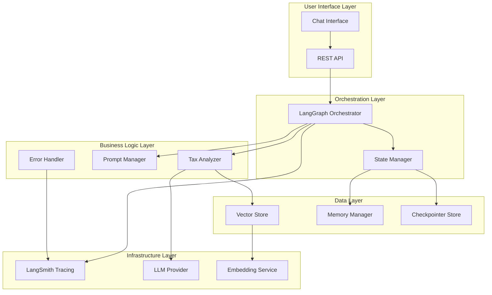
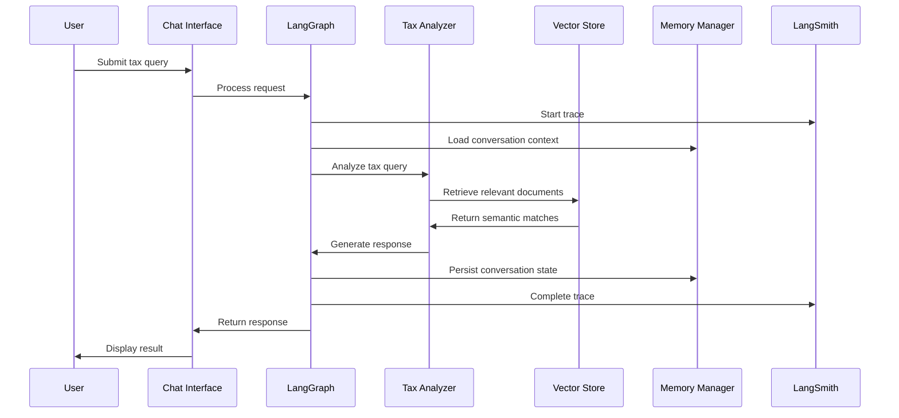

# Design Document: AI Tax Agent System Improvements

## Overview

This design outlines the architectural improvements for the "Agente Tributário" AI Tax Agent system. The current system is built with LangChain and LangGraph but suffers from critical gaps in retrieval accuracy, observability, memory persistence, and architectural modularity. This enhancement preserves the existing LangGraph orchestration while implementing vector-based RAG, comprehensive tracing, persistent storage, and modular architecture patterns.

The design prioritizes the P0 critical gaps (vector RAG implementation) and P1 high-impact improvements (persistent memory, observability) while establishing a foundation for future P2 architectural enhancements.

## Architecture

### High-Level Architecture



### Component Interaction Flow



## Components and Interfaces

### 1. Vector Store Component

**Purpose**: Replace term-frequency based retrieval with semantic vector search

**Interface**:
```python
class VectorStore:
    def index_documents(self, documents: List[Document]) -> None
    def similarity_search(self, query: str, k: int = 5) -> List[Document]
    def add_documents(self, documents: List[Document]) -> None
    def delete_documents(self, document_ids: List[str]) -> None
```

**Implementation Strategy**:
- **Primary Choice**: Redis with RediSearch for unified storage and vector search
  - High-performance in-memory storage with persistence
  - Native vector similarity search capabilities
  - Unified solution for both memory checkpoints and document retrieval
- **Embedding Model**: sentence-transformers/all-MiniLM-L6-v2
  - Multilingual support for Portuguese tax documents
  - Good balance of performance and accuracy
  - 384-dimensional embeddings optimized for Redis vector indexing

### 2. LangSmith Integration Component

**Purpose**: Provide comprehensive observability and tracing

**Interface**:
```python
class ObservabilityManager:
    def trace_langgraph_execution(self, graph_name: str) -> ContextManager
    def log_llm_interaction(self, prompt: str, response: str, tokens: int) -> None
    def log_error(self, error: Exception, context: Dict) -> None
    def track_performance_metrics(self, operation: str, duration: float) -> None
```

**Implementation Strategy**:
- **Environment Configuration**: Set LANGCHAIN_TRACING_V2=true and LANGCHAIN_API_KEY
- **Automatic Tracing**: LangGraph nodes automatically traced when using LangChain modules
- **Custom Tracing**: Use @traceable decorator for non-LangChain components
- **Metrics Collection**: Track token usage, latency, error rates, and success rates

### 3. Memory Manager Component

**Purpose**: Replace volatile MemorySaver with persistent conversation storage

**Interface**:
```python
class MemoryManager:
    def save_checkpoint(self, thread_id: str, checkpoint: Checkpoint) -> None
    def load_checkpoint(self, thread_id: str) -> Optional[Checkpoint]
    def list_checkpoints(self, thread_id: str) -> List[CheckpointMetadata]
    def delete_thread(self, thread_id: str) -> None
```

**Implementation Strategy**:
- **Primary Storage**: Redis with langgraph-checkpoint-redis
  - High-performance in-memory storage with configurable persistence
  - Excellent for conversation state and session management
  - Built-in support for TTL and automatic cleanup
- **Unified Architecture**: Same Redis instance for both memory and vector storage
  - Simplified deployment and maintenance
  - Reduced infrastructure complexity
- **Checkpointer Integration**: Replace MemorySaver in LangGraph compilation

### 4. Tax Analyzer Component

**Purpose**: Encapsulate tax-specific analysis logic with enhanced capabilities

**Interface**:
```python
class TaxAnalyzer:
    def analyze_tax_scenario(self, query: str, context: List[Document]) -> TaxAnalysis
    def validate_tax_calculation(self, calculation: Dict) -> ValidationResult
    def get_confidence_score(self, analysis: TaxAnalysis) -> float
    def format_tax_response(self, analysis: TaxAnalysis) -> str
```

**Enhanced Capabilities**:
- **Confidence Scoring**: Quantify analysis reliability based on document relevance and completeness
- **Step-by-Step Breakdown**: Decompose complex tax scenarios into clear reasoning steps
- **Validation Logic**: Cross-reference calculations against known tax rules and precedents
- **Uncertainty Handling**: Clearly indicate when human review is recommended

### 5. Prompt Manager Component

**Purpose**: Replace hardcoded prompts with versioned, manageable templates

**Interface**:
```python
class PromptManager:
    def get_prompt(self, prompt_name: str, version: Optional[str] = None) -> PromptTemplate
    def update_prompt(self, prompt_name: str, template: str, version: str) -> None
    def rollback_prompt(self, prompt_name: str, target_version: str) -> None
    def validate_prompt(self, template: str) -> ValidationResult
```

**Implementation Strategy**:
- **Storage**: JSON/YAML files with version metadata
- **Template Engine**: LangChain PromptTemplate with variable substitution
- **Version Control**: Semantic versioning (major.minor.patch) for prompt changes
- **Validation**: Template syntax checking and required variable validation

### 6. Error Handler Component

**Purpose**: Implement robust retry logic and graceful error handling

**Interface**:
```python
class ErrorHandler:
    def retry_with_backoff(self, func: Callable, max_retries: int = 3) -> Any
    def handle_api_error(self, error: Exception) -> ErrorResponse
    def log_and_recover(self, error: Exception, context: Dict) -> Optional[Any]
    def get_fallback_response(self, query: str) -> str
```

**Retry Strategy**:
- **Exponential Backoff**: 1s, 2s, 4s, 8s intervals with jitter
- **Retryable Errors**: Network timeouts, rate limits, temporary service unavailability
- **Non-Retryable Errors**: Authentication failures, malformed requests, quota exceeded
- **Circuit Breaker**: Temporarily disable failing services to prevent cascade failures

## Data Models

### Core Data Structures

```python
@dataclass
class TaxDocument:
    id: str
    title: str
    content: str
    document_type: str  # regulation, precedent, form, guide
    effective_date: datetime
    source: str
    embedding: Optional[List[float]] = None

@dataclass
class TaxAnalysis:
    query: str
    relevant_documents: List[TaxDocument]
    analysis_steps: List[str]
    conclusion: str
    confidence_score: float
    recommendations: List[str]
    requires_human_review: bool

@dataclass
class ConversationState:
    thread_id: str
    messages: List[Message]
    context_documents: List[TaxDocument]
    current_analysis: Optional[TaxAnalysis]
    user_preferences: Dict[str, Any]

@dataclass
class ErrorContext:
    operation: str
    timestamp: datetime
    error_type: str
    retry_count: int
    user_context: Dict[str, Any]
```

### Database Schema

**Redis Schema for Memory Persistence**:
```python
# Redis key patterns for LangGraph checkpoints
# Managed by langgraph-checkpoint-redis
CHECKPOINT_KEY = "checkpoint:{thread_id}:{checkpoint_id}"
THREAD_KEY = "thread:{thread_id}"
METADATA_KEY = "metadata:{thread_id}"

# Custom Redis keys for enhanced conversation metadata
CONVERSATION_META_KEY = "conversation:meta:{thread_id}"
USER_SESSIONS_KEY = "user:sessions:{user_id}"
```

**Redis Vector Index Configuration**:
```python
# RediSearch vector index for tax documents
vector_index_config = {
    "index_name": "tax_documents_idx",
    "schema": [
        VectorField("embedding", "FLAT", {
            "TYPE": "FLOAT32",
            "DIM": 384,  # sentence-transformers dimension
            "DISTANCE_METRIC": "COSINE"
        }),
        TextField("content"),
        TextField("title"),
        TextField("document_type"),
        TextField("source"),
        NumericField("effective_date")
    ]
}
```

## Correctness Properties

*A property is a characteristic or behavior that should hold true across all valid executions of a system—essentially, a formal statement about what the system should do. Properties serve as the bridge between human-readable specifications and machine-verifiable correctness guarantees.*

### Property 1: Vector-Based Semantic Retrieval
*For any* tax query submitted to the system, the RAG_System should use vector embeddings to retrieve documents ranked by semantic similarity rather than term frequency, and all returned documents should be semantically relevant to the query.
**Validates: Requirements 1.1, 1.3**

### Property 2: Document Embedding Generation
*For any* document indexed by the Vector_Store, embeddings should be generated using the configured embedding model and stored successfully, enabling subsequent similarity searches.
**Validates: Requirements 1.2**

### Property 3: Configurable Search Results
*For any* similarity search with a specified result limit k, the Vector_Store should return exactly k results (or fewer if insufficient documents exist) within acceptable performance bounds.
**Validates: Requirements 1.4**

### Property 4: Comprehensive Observability Tracing
*For any* LangGraph node execution, API call, or system operation, the Observability_System should create appropriate traces in LangSmith with complete context including request/response details, latency metrics, and token usage.
**Validates: Requirements 2.1, 2.2, 2.4**

### Property 5: Error Context Capture
*For any* error that occurs in the system, the Observability_System should capture complete error context including stack traces, operation details, and performance metrics for debugging.
**Validates: Requirements 2.3, 2.5**

### Property 6: Memory Persistence Round-Trip
*For any* conversation state, persisting it to durable storage and then restoring it should yield an equivalent conversation state, maintaining all context and history across system restarts.
**Validates: Requirements 3.1, 3.2, 3.3**

### Property 7: Memory Retention Policy Enforcement
*For any* configured retention policy, the Memory_Manager should enforce the policy correctly, removing expired conversations while preserving active ones, and handle memory operation failures gracefully without data loss.
**Validates: Requirements 3.4, 3.5**

### Property 8: Exponential Backoff Retry Logic
*For any* API call failure, the Tax_Agent should implement exponential backoff retry logic with the correct timing pattern (1s, 2s, 4s, 8s) and provide meaningful error messages when retries are exhausted.
**Validates: Requirements 4.1, 4.2**

### Property 9: Robust Error Handling and Degradation
*For any* network timeout, service unavailability, or system error, the Tax_Agent should handle the situation gracefully without crashing, log all retry attempts, and degrade functionality appropriately while maintaining conversation continuity.
**Validates: Requirements 4.3, 4.4, 4.5**

### Property 10: Prompt Version Management Round-Trip
*For any* prompt template, updating it should maintain complete version history, support rollback to any previous version, and validate templates before deployment, with all prompt access logged for traceability.
**Validates: Requirements 6.1, 6.2, 6.3, 6.4, 6.5**

### Property 11: Tax Analysis Validation and Confidence
*For any* tax calculation or analysis, the Tax_Analyzer should validate results against known tax rules, provide confidence scores, break down complex scenarios into clear steps, and indicate when human review is needed for uncertain scenarios.
**Validates: Requirements 7.1, 7.2, 7.4, 7.5**

### Property 12: Tax Regulation Integration
*For any* updated tax regulation added to the system, the Tax_Analyzer should incorporate it through the RAG_System and use it in subsequent analyses, ensuring current legal compliance.
**Validates: Requirements 7.3**

### Property 13: System Integration Compatibility
*For any* system improvement or architectural change, all existing LangGraph state transitions, Pydantic validation, human-in-the-loop capabilities, specialized tax analysis nodes, and testing structures should continue to function correctly.
**Validates: Requirements 8.1, 8.2, 8.3, 8.4, 8.5**

## Error Handling

### Error Classification and Response Strategy

**Retryable Errors**:
- Network timeouts (HTTP 408, connection timeouts)
- Rate limiting (HTTP 429)
- Temporary service unavailability (HTTP 502, 503, 504)
- Transient database connection failures

**Non-Retryable Errors**:
- Authentication failures (HTTP 401, 403)
- Malformed requests (HTTP 400)
- Resource not found (HTTP 404)
- Quota exceeded (permanent limits)

**Error Recovery Patterns**:

```python
class ErrorRecoveryStrategy:
    def handle_llm_failure(self, error: Exception) -> str:
        """Provide fallback response when LLM is unavailable"""
        return "I'm experiencing technical difficulties. Please try again or contact support."
    
    def handle_rag_failure(self, query: str) -> List[Document]:
        """Fallback to cached or default documents when RAG fails"""
        return self.get_cached_documents(query) or self.get_default_tax_documents()
    
    def handle_memory_failure(self, thread_id: str) -> ConversationState:
        """Create new conversation state when memory retrieval fails"""
        return ConversationState.create_new(thread_id)
```

### Circuit Breaker Implementation

```python
class CircuitBreaker:
    def __init__(self, failure_threshold: int = 5, recovery_timeout: int = 60):
        self.failure_threshold = failure_threshold
        self.recovery_timeout = recovery_timeout
        self.failure_count = 0
        self.last_failure_time = None
        self.state = "CLOSED"  # CLOSED, OPEN, HALF_OPEN
```

## Testing Strategy

### Dual Testing Approach

The system requires both unit testing and property-based testing to ensure comprehensive coverage:

**Unit Tests**: Focus on specific examples, edge cases, and integration points
- Specific tax calculation examples with known correct results
- Error condition handling (network failures, invalid inputs)
- Component integration verification
- Edge cases (empty documents, malformed queries)

**Property-Based Tests**: Verify universal properties across all inputs
- Vector similarity search correctness across random queries
- Memory persistence round-trip properties
- Error handling behavior under various failure conditions
- Observability trace completeness for all operations

### Property-Based Testing Configuration

**Testing Framework**: Hypothesis (Python) for property-based testing
- Minimum 100 iterations per property test to ensure statistical confidence
- Custom generators for tax-domain specific data (queries, documents, calculations)
- Shrinking enabled to find minimal failing examples

**Test Tagging**: Each property test must reference its design document property
- Tag format: **Feature: ai-tax-agent-improvements, Property {number}: {property_text}**
- Example: **Feature: ai-tax-agent-improvements, Property 1: Vector-Based Semantic Retrieval**

**Test Data Generation**:
```python
@given(
    tax_query=st.text(min_size=10, max_size=200),
    document_count=st.integers(min_value=1, max_value=100)
)
def test_vector_retrieval_property(tax_query: str, document_count: int):
    """Feature: ai-tax-agent-improvements, Property 1: Vector-Based Semantic Retrieval"""
    # Test implementation
```

### Integration Testing Strategy

**LangGraph Integration Tests**:
- Verify complete conversation flows through all nodes
- Test state persistence across node transitions
- Validate human-in-the-loop interruption and resumption

**External Service Integration**:
- Mock LLM providers for consistent testing
- Test vector store operations with embedded test data
- Verify LangSmith tracing integration with test traces

**Performance Testing**:
- Vector search latency under various document set sizes
- Memory persistence performance with large conversation histories
- Concurrent user simulation for scalability validation

### Test Environment Configuration

**Development Environment**:
- SQLite checkpointer for fast test execution
- In-memory ChromaDB for vector operations
- Mock LLM responses for deterministic testing

**Staging Environment**:
- PostgreSQL checkpointer matching production
- Persistent ChromaDB with test document corpus
- Real LLM integration with rate limiting

**Production Monitoring**:
- Continuous property validation through synthetic transactions
- Performance regression detection through automated benchmarks
- Error rate monitoring with alerting thresholds